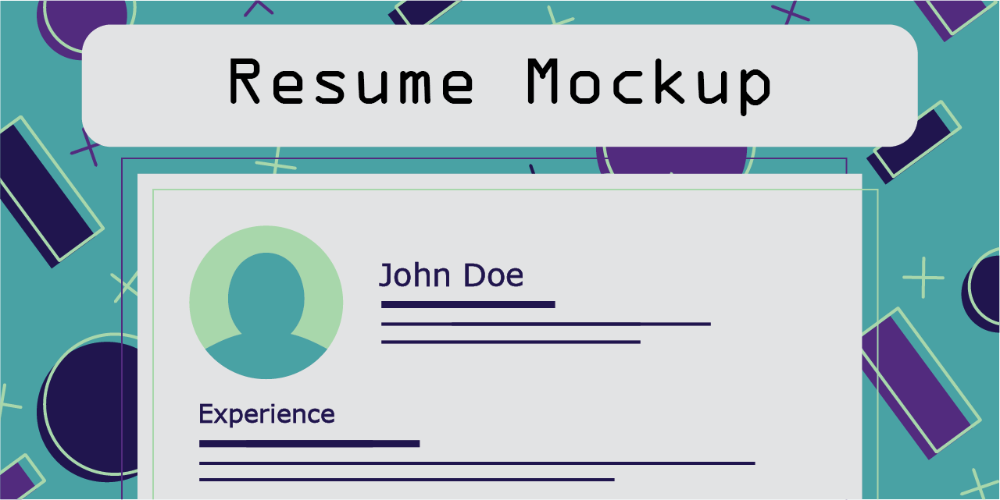

# Simple HTML5 Resume Mockup

## Table of Contents
[Description](#description)
[Disclaimer](#disclaimer)
[Limitations](#limitations)
[Lessons Learned and Recommendations](#lessions-learned-and-recommendations)

## Description
For my first webdevelopment project I decided to create a simple resume mockup using HTML5.
Doing this allowed me to learn about essential HTML tags such as divs and tables, inline styling, using the inspect feature in browsers and to get familiar with online documentation such as [DevDocs API documentation](https://devdocs.io/) and [MDN web docs](https://developer.mozilla.org/en-US/docs/Web/HTML).
The code was written in Visual Studio Code and inspected in Google Chrome.

## Disclaimer
All names and images portrayed on this website are fictitious or have been artifically created. No identification with actual people (living or deceased), places, and buildings is intended or should be inferred.

## Limitations
Using only HTML5 allows for little more than the creation of paragraphs of text and headlines. Inline styling is time consuming and error prone, thus it is more efficient to link to an external style sheet and assign classes to elements that need uniform modification.

## Lessons Learned and Recommendations
HTML is essentially the creation and arrangement of boxes containing texts, linkes or images on a website. Those boxes can be modified or displaced by nesting them within other HTML elements or using CSS properties.
Alternativly one can link to a cached version of Bootstrap's compiled CSS under the section [CDN via jsDeliver](https://getbootstrap.com/docs/5.2/getting-started/download/) and use that instead of a self made external stylesheet.
